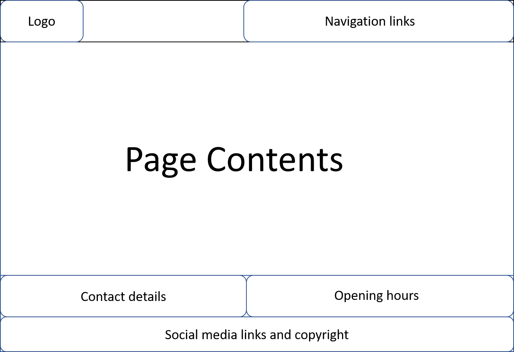
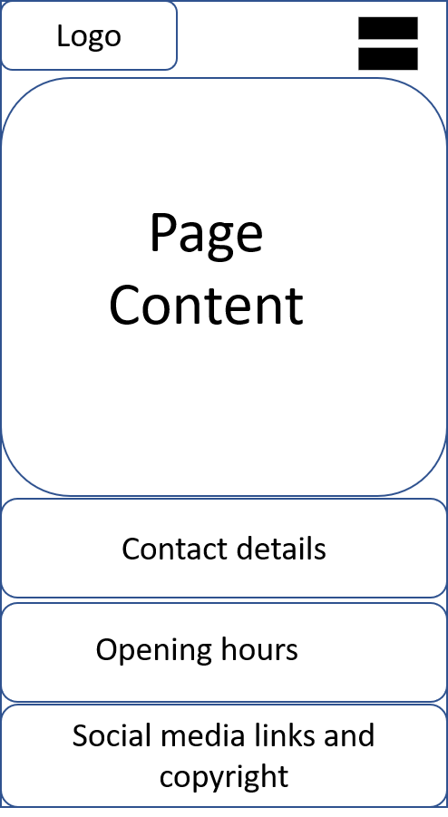

# Table of Content
- [Synopsis](#synopsis)
- [Author](#Author)
- [License & Copyrights](#License-&-Copyrights)
- [Author](#Author)
- [Live Demo](#Live-Demo)
  - [Quick Live Preview - Desktop](#Quick-Live-Preview-Desktop)
  - [Quick Live Preview - Tablet](#Quick-Live-Preview-Tablet)
  - [Quick Live Preview - Mobile](#Quick-Live-Preview-Mobile)
- [What is achieved?](#What-is-achieved?)
- [Development Process](#Development-Process)
- [Bugs and fixes](#Bugs-and-fixes)
- [Reference](#Reference)


## Synopsis
This is a static website for a typical restaurant in the high street.

It was created using the following languages:

* HTML
* CSS

### External User Goals
  - As an external user, I want to be able to browse browse the restaurant website to find out information about the restaurant
  - As an external user, I wanto to be able to navigate through the website and easily book online
  - As an extenal user, I want to find out about the restaurant menu and the prices
  - As an external user, I want to find the contact information and opening hours.
  - As an external user I want to visit the various social media links to look at pictures of the various dishes and review customer testimonials.

### Restaurant Owner Goals
  - As a restaurant owner, I want to be able to provide all the information about the restaurant and the dishes 
  - As a restaurant owner, I want my website to be able to attract more customers via pomotional offers which will be advertised on the website and social media links in order to increase cystiner visits to the restaurant.
  - As a restaurant owner, I want visitors to be able to easily navigate throughout the website to reserve and make online bookings easily as well as locate the location of the restaurant via the linked map. 
  - As a restaurant owner, I want the opening and closing times to easily be indicated on the website so potential customers can find it on all the browsing tabs at the bottom without going through the trouble of looking for it.
  - As a restaurant owner, I want my customers to be able to look at the menu and the prices.

### Returning Visitor Goals
- As a returning visitor, I want to find an easy way to contact the restaurant regarding any questions I may have.
- As a returning visitor, I want to check the dish prices online
- As a returning visitor, I want to look for their social media links

### Frequent User Goals
- As a frequent user of the restaurant, I want to check the website to see if there are any promotional offers on the dishes. 
- As a frequent user of the restaurant, I want to check if the menu has been updated with new dishes.

## Author
Design and coded by Fero Hamed

## License & Copyrights
Please Refer to for [License](LICENSE) 

## Live Demo

To see the live demo, please [click here](https://ferohmd.github.io/MS1-Project/).

### Quick Live Preview Desktop
.png "Preview")

### Quick Live Preview Tablet
.png "Preview")

### Quick Live Preview Mobile
.png "Preview")

## What is achieved?
  - Main navigation menu and a structured layout
  - Accessibility
  - Photos showcased
  - Provided links to external resources (social media icons)
  - Website includes 4 pages
  - Wrote custom CSS code that passed through the official (Jigsaw) validator with no issues
  - Used CSS media queries
  - Wrote custom HTML code that passed through the official W3C validator with no issues.
  - Used Semantic markup to structure HTML code with site specific content
  - Well documented
  - Well tested on desktop, mobile and ipad
  - 90% lighthouse report.

## Development Process
I have followed the software developement life cycle.

## Requirement gathering
  - I want to be able to find on the website the contact details of the restaurant
  - I want to be able to find opening hours of the restaurant
  - I want to be able to find the menu served by the restaurant including the prices
  - I want to be able to book online to reserve a table to dine in

## Analysis
  - Contact details and opening hours can be show besides each other
  - Menu page to show the list of menu being served by the restaurant
  - Booking page to book online and reserve a table
  - Additionaly, design home page/about page
  - Need a navigation to different page

## Design

### Colour scheme: 
- The main colour of the page is black with the title colour in Green and black as the two colours as it matches the rest of the website. Throughout the website the navbar and contact details are all in white colour, as its simple. 
- I want the website to look as minimal, simple, easy to navigate with a sleek style. 

### Typography
- The text is consistent across all pages.

### Images:
- The images used are of high quality that even when scale according to different device sizes the quality does not reduce. 

  - Common page layout for desktop and tablet
  
  
  - Mobile page layout
  

Below you can find the initial drafts of the wireframes I created for the pages, illustrating how I would want the page to be structured. 

## Implementation
  - Responsive design of a restaurant website
  - Static website implemented using HTML and CSS. 
  - Google Font is used. 
  - Semantic tags used in all pages.
  - Stylesheets/fonts are loaded in the head of the page
  - Logo in the header as rotation animation powered by css
  - CSS global variables are used (variables.css) for theming
  - Static files are located in assets folder
  - Google map integrated using Google Map Generator [https://google-map-generator.com/]

### Project structure
```
│   .gitignore
│   about-navigation.html
│   about.html
│   booking-navigation.html
│   booking.html
│   index.html
│   LICENSE
│   menu-navigation.html
│   menu.html
│   navigation.html
│   README.md
│   robots.txt
│
├───assets
│   ├───css
│   │       booking-form.css
│   │       home.css
│   │       menu.css
│   │       styles.css
│   │       variables.css
│   │
│   ├───img
│   │       about.jpg
│   │       background.jpg
│   │       book-a-table.jpg
│   │       bread.jpg
│   │       cookies.jpg
│   │       donut.jpg
│   │       icon-512.png
│   │       menu.png
│   │       menu1.jpg
│   │       menu2.jpg
│   │       menu3.jpg
│   │       menu4.jpg
│   │       milkshake.jpg
│   │
│   └───pwa
│           icon-192x192.png
│           icon-256x256.png
│           icon-384x384.png
│           icon-512x512.png
│           manifest.json
│
└───docs

    │   CSS_VALIDATOR.md
    │   HTML_VALIDATOR.md
    │   TESTING.md
    │
    ├───css-validator
    │       booking-form.css.png
    │       home.css.png
    │       menu.css.png
    │       styles.css.png
    │       variables.css.png
    │
    ├───html-validator
    │       about-index.html.png
    │       about-navigation-index.html.png
    │       booking-index.html.png
    │       booking-navigation-index.html.png
    │       index.html.png
    │       menu-index.html.png
    │       menu-navigation-index.html.png
    │       navigation-index.html.png
    │
    ├───light-house-reports
    │       about.pdf
    │       home.pdf
    │       menu.pdf
    │
    ├───preview
    │   ├───desktop
    │   │       about.png
    │   │       booking(1).png
    │   │       booking(2).png
    │   │       home(1).png
    │   │       home(2).png
    │   │       menu(1).png
    │   │       menu(2).png
    │   │       menu(3).png
    │   │
    │   ├───mobile
    │   │       about(1).png
    │   │       about(2).png
    │   │       booling(1).png
    │   │       booling(2).png
    │   │       booling(3).png
    │   │       booling(4).png
    │   │       home(1).png
    │   │       home(2).png
    │   │       menu(1).png
    │   │       menu(2).png
    │   │       menu(3).png
    │   │       menu(4).png
    │   │       navigation.png
    │   │
    │   └───tablet
    │           about.png
    │           booking(1).png
    │           booking(2).png
    │           home(1).png
    │           home(2).png
    │           menu(1).png
    │           menu(2).png
    │           menu(3).png
    │
    └───wireframes
            desktop-tablet-layout.png
            mobile - navigation.png
            mobile-page-layout.png
            Wireframes.pptx 
```
### Pages (laptop/tablet/mobile)
  - [Home page](./index.html) 
    - [Mobile only Navigation (Home active)](./navigation.html) 
  - [About page](./about.html) 
    - [Mobile only Navigation (About active)](./about-navigation.html) 
  - [Menu page](./menu.html) 
    - [Mobile only Navigation (Menu active)](./menu-navigation.html) 
  - [Booking page](./booking.html)
    - [Mobile only Navigation (Booking active)](./booking-navigation.html)  

## Testing
Testing report found in [TESTING.md](./docs/TESTING.md)

## Bugs and fixes
- Booking Page
  Bug: on submitting the booking form, URL used to change with some query strings.
  Fix: Form method used as post with empty action. removed mthod attribute from form and changed action to /booking, which fixed the issue.

- Mobile Pages
  Bug: On clicking hamburger menu, not able to see the navigation menu as a popover/slide in menu.
  Fix: Without Javascript, achieving the modal/popover is difficult. I had to implemente it as a separate page

  - The Logo 
  Bug: The logo at the top left of all the pages would not take user back to the home page
  Fix: There was a typo

  - Bug: URL was not routed properly so could not land on the pages I wanted i.e. about/booking or go back to the home page
  Fix: I noticed with the about.html or menu.html it would work on the local desktop but not on the github server so what I did was to go back on to the navbar and added the name of the project: ms1-project to route it correctly on to the pages on the github server.

  ### Known Bugs
 - When using an Ipad, on the about, it looks like it has not been scaled properly. As I had issues using Bootstrap for scaling, I focussed on  just using plain css and media query for scaling purposes. Although the sizing of the website  comes out neatly on all devices. It looks fine on all devices except the about page on an Ipad. Looks like the image is overlaying the text. 

## Lighthouse Reports
My website was tested using Lighthouse in the Google Development Tools. Considering that this was my first website design, I am quite content with the outcome, as I went for a simple but sleek look which I did attain. I am pretty content with the performance of the website, though per haps reducing the image size on the home page may helped with the performance score of 88%. 

[Home Page](./docs/light-house-reports/home.pdf)
[Menu page](./docs/light-house-reports/menu.pdf)
[about Page](./docs/light-house-reports/about.pdf)

## Deployment
The project has been deployed on Github Pages by using the following techniques:
1: Log in to Github and find the repository one wishes to deploy.
2: Once on the reposity page, click on the settings icon.
3: Scroll down the setting pages until you reach the section called "GitHub Pages".
4: Once on the Github Pages, click on the "Source" subheading click the dropdown labelled "None", select main and click save.
5: The page will then automatically refresh
6: Once it is refreshed, you will see a green tick that the page is published to Github Pages. ( Your site is published at https://ferohmd.github.io/MS1-Project/)

## Creating a local clone of the repository
1: Log in on GitHub and find the repository you wish to make a copy off.
2: Click on the dropdown labelled ''Code'' in the green button and copy the link,
3: Once that the URL is copied, open Git Bash.
4: Bring changes to the location of where you want the cloned directory to be made.
5: Type in 'Gitclone' and paste the above URL copied. 

## References
  - Google Map Generator: [https://google-map-generator.com/](https://google-map-generator.com/)

  - Name that color: [https://chir.ag/projects/name-that-color/](https://chir.ag/projects/name-that-color/#6195ED)

  - Google Images: [https://www.google.com/](https://www.google.com/)

  - Images: [https://www.pexels.com](https://www.pexels.com)

  - Media Query: [https://www.w3schools.com/css/css_rwd_mediaqueries.asp] (https://www.w3schools.com/css/css_rwd_mediaqueries.asp)

  - W3School: [https://www.w3schools.com/] (https://www.w3schools.com/)
  Provided me with 'how it works' sections in developing my website

## Acknowledgements
- I would like to thank my mentor, Gerard McBride for the help and support.
- Code Institute for teaching the relevant skills and ability to create the website.
- Code Institute Tutors for all the support. 
